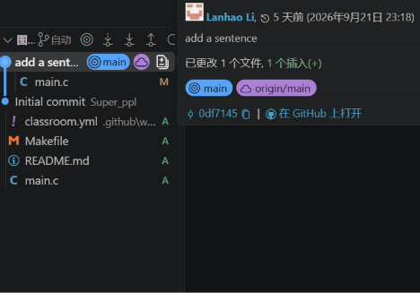
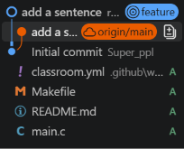
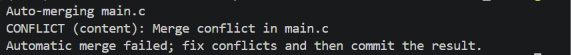

# 计算机系统基础 Lab0 实验报告

姓名：李蓝浩　仓库：<https://github.com/regular-server/ICS_Lab0>

## 一、实验环境

Windows + VS Code，编译器 GCC，远程仓库托管在 GitHub 上（由 GitHub Classroom 分发）。

## 二、文档中要求回答的问题

### 1. 多人协同开发的经历

以前没有参与过正式的多人开发。和同学一起写小东西时，基本是两种办法：要么在腾讯文档里同步编辑，要么各自改好文件在微信群里传来传去，谁手里的版本最新全靠聊天记录确认。

现在回头看，这类协作其实分成两种情况。一种是串行的，前一个人做完，后一个人才能开始，好处是不用合并，坏处是一环卡住就全线等；另一种是并行的，各人同时推进自己的部分，最后再交流合并，安排更灵活、效率也更高，但多出一个新问题：几个人改到同一处时该听谁的。

这次实验让我体会到，并行开发真正的难点不在分工，而在合并。Git 的价值就是把合并变成一件有规则、可追溯、可回退的事，而不是靠人肉沟通。

### 2. 为什么要设计暂存和提交两步

我一开始觉得暂存区是多余的一层，改完直接提交不就行了。做完实验后的理解是：暂存区把“我改了什么”和“我打算提交什么”分开了。

工作区是随手改的地方，改动通常零散、不完整；而一次提交在 Git 里是一份完整的项目快照，应该对应一件说得清楚的事。暂存区就是两者之间的筛选台：改了五个文件但只有三个属于同一件事，可以只 add 这三个；add 之前能用 `git diff` 和 `git diff --cached` 分别看未暂存和已暂存的改动，有最后一次反悔的机会；杂乱的修改也可以拆成几个小提交，日后查看历史和回滚都方便。

说白了，它换来的是提交历史的可读性，而可读性是协作的前提。

### 3. `git branch` 和 `git branch -a` 的区别

`git branch` 只列出本地分支，当前分支前面带 `*`；`git branch -a` 相当于 `--all`，还会列出远程分支。我的仓库里两者输出分别是：

```text
$ git branch
  feature
* main

$ git branch -a
  feature
* main
  remotes/origin/HEAD -> origin/main
  remotes/origin/main
```

要注意 `remotes/origin/main` 并不是远程那个分支本身，而是本地保存的一份引用，记录我上次和远程通信时对方的 main 指向哪里。它是只读的书签，不能直接在上面提交，要 `git fetch` / `git pull` 才会更新，要 `git push` 才会把本地提交送上去。

## 三、实验步骤

### 1. 完成 main.c 的 TODO

从 GitHub Classroom 拿到个人仓库并克隆到本地，初始提交是 `1a3eddf Initial commit`。在 `main.c` 的 `// @TODO` 下面加了一行输出，提交信息为 `add a sentence`，提交号 `0df7145`。

```c
printf("Git is powerful!\n");
```



编译运行结果：

```text
Hello, world!
Git is powerful!
```

输出和模板原本的不一样，符合评分脚本“输出与 `Hello, world!` 不同即通过”的判定。

### 2. 建立 feature 分支并提交

```bash
git checkout -b feature
```

在 `feature` 上把输出语句改成相反的表述，然后提交：

```c
printf("Git is not powerful!\n");
```

```bash
git add main.c
git commit -m "add a sentence"
```

### 3. 在 main 上做一次冲突修改

我第一次的做法是在原语句下方新增一行，结果 `git merge feature` 直接成功了，当时还以为是自己操作有问题。查了历史才明白，那次是快进合并：`main` 上此后没有新提交，Git 只要把分支指针往前推就行，根本不进入内容比对，自然不会冲突。

于是我改成让两个分支动同一行：`main` 上是 `Git is powerful!`，`feature` 上是 `Git is not powerful!`。

```bash
git checkout main
# 把 main.c 里的输出改回 "Git is powerful!"
git add main.c
git commit -m "add a sentence"
```

这时两个分支从同一个基点分开，各自对同一行做了不同修改。

### 4. 合并出现冲突

```bash
git merge feature
```

```text
Auto-merging main.c
CONFLICT (content): Merge conflict in main.c
Automatic merge failed; fix conflicts and then commit the result.
```



自动合并失败，Git 把冲突内容写进 `main.c`，仓库进入合并中间态（`git status` 提示 `You have unmerged paths`）。

### 5. 解决冲突

文件里被插入了三行标记：

```c
    printf("Hello, world!\n");
<<<<<<< HEAD
    printf("Git is powerful!\n");
=======
    printf("Git is not powerful!\n");
>>>>>>> feature
}
```

`<<<<<<< HEAD` 到 `=======` 之间是当前分支（main）的内容，`=======` 到 `>>>>>>> feature` 之间是待合并分支（feature）的内容。我需要做的就是从两者中选一个，然后把标记全部删掉，最后保留了 main 分支上的写法：

```c
    printf("Hello, world!\n");
    printf("Git is powerful!\n");
```

有个小插曲：标记没删干净时编译会直接报错，等于多了一道保险。

```text
main.c:7:1: error: version control conflict marker in file
```

删掉标记后程序恢复正常，于是提交这次合并，完成整个 merge。

```bash
git add main.c
git commit -m "Merge branch 'feature' into main"
```



最终历史：

```text
*   748d14f (HEAD -> main) Merge branch 'feature' into main
|\
| * 204577a (feature) add a sentence      → "Git is not powerful!"
* | 0df7145 (origin/main) add a sentence  → "Git is powerful!"
|/
* 1a3eddf Initial commit
```

## 四、关于冲突的几点认识

结合这次实验，什么情况下会冲突：两个分支改了同一行；改的是相邻的行，差异范围重叠；一边改了文件、另一边把文件删了；一边重命名文件、另一边还在改内容。

解决的办法也比较固定：先用 `git status` 找出状态是 `both modified` 的文件，打开看清两组标记，人工决定保留哪边或者重写，删掉全部标记，编译测试通过后 `git add`，再 `git commit`。中途不想要了可以 `git merge --abort` 退回去。

我的体会是，冲突其实是 Git 在说“这里我判断不了，得人来定”。它本质上是语义上的取舍，机器代替不了。减少冲突也不是靠不用分支，而是把提交拆小、分支寿命缩短、经常和主干同步，这和 Git Flow 里“功能分支尽快合回 develop”的建议是一致的。

## 五、为什么要学习 Git

按题目要求，我读了《Commit Message 规范》和《Git Flow 分支控制》两篇。

**Commit Message 规范。** 每次提交都必须写说明，规范的提交信息分三部分：Header、Body、Footer。Header 是必需的标题，由 type、scope、subject 组成，其中 scope 可省略。type 说明这次改动的性质：`feat` 新功能、`fix` 修补 bug、`docs` 文档、`style` 格式（不影响代码运行）、`refactor` 重构、`test` 增加测试、`chore` 构建或辅助工具的变动。只用一个单词就能让人对改动的性质有基本判断，这是规范最大的用处。Body 写详细说明，主要解释为什么这样改；Footer 放附加信息，比如是否关闭某个 issue、是否包含 BREAKING CHANGE。文中还提到两个工具：Commitizen 帮助生成规范的提交信息，validate-commit-msg 用来检查提交信息是否合规。

**Git Flow 分支控制。** 它是一种分支管理模型，用不同类型的分支表示代码所处的阶段。master（main）放生产环境的稳定代码；develop 是日常开发的主分支，集成各个功能；feature 从 develop 切出，做完合回 develop；release 从 develop 切出，用于准备发版，完成后合回 master 和 develop；hotfix 从 master 切出修紧急 bug，修完同样合回两边。典型流程就是从 develop 开一个 `feature/功能名` 分支，在上面开发并提交，完成后合回 develop 做集成测试。

读完这两篇，我对“为什么要学 Git”的想法是：如果只看写代码，Git 连着 GitHub，好像只是个方便存东西的云盘。但它真正的作用是代码管理工具，这一点体现在三处。一是历史可读，每次提交都说明改了什么，配合规范的提交信息，`git log` 本身就是一份开发日志。二是能并行，分支让各人互不影响地推进，再通过合并汇总，把前面说的“微信群传文件”变成有结构的流程。三是能回退，每个提交都是完整快照，所以敢试错。这次做实验我就用了几次 `git reset` 和 `git checkout` 重做分支操作，知道弄错了能退回去，动手时就不那么犹豫。

## 六、任务完成情况

| 任务 | 状态 |
| --- | --- |
| 回答文档中的三个问题 | 完成，见第二节 |
| 完成 `main.c` 的 TODO 并提交 | 完成，提交 `0df7145` |
| 阅读两篇资料并谈理解 | 完成，见第五节 |
| 新建 `feature` 分支，两边各修改并提交 | 完成，提交 `204577a` / `0df7145` |
| merge 时出现冲突 | 完成，见第三节第 4 步 |
| 解决冲突并完成合并 | 完成，见第三节第 5 步，提交 `748d14f` |
| 在 `main` 分支提交实验报告 | 完成，本文件 |

## 七、建议

1. 文档里可以明确提一句“快进合并不会产生冲突”。我在这上面卡了一阵，一直以为自己做错了，其实只要 main 分支在切出 feature 之后没有新提交，合并就只是移动指针，不会做内容比对。写清楚这一点应该能省下不少同学的困惑。
2. Windows 下如果没装 make（或者只装了 MinGW 却没把 `mingw32-make` 加进 PATH），文档里的 `make` 会直接报“无法识别”，可以直接用 `gcc -Wall -O2 -o main main.c` 编译。自动评分跑在 Ubuntu 上不受影响，但加一句说明会让本地开发顺很多。
3. 给同学的一句话：亲手做一次分支、制造一次冲突再解决掉，比读教程有用得多。我这次收获最大的地方，恰恰是那次没冲突的失败尝试，先看到现象，再查清原因，然后改做法。

## 参考资料

- 课程文档：<https://ics-26fall-fdu.github.io/labs/lab0-git-lab/>
- 阮一峰《Commit Message 和 Change Log 编写指南》：<https://www.ruanyifeng.com/blog/2016/01/commit_message_change_log.html>
- 《Git Flow 分支控制》：<https://www.dafaycoding.com/article/git-gif-flow>
